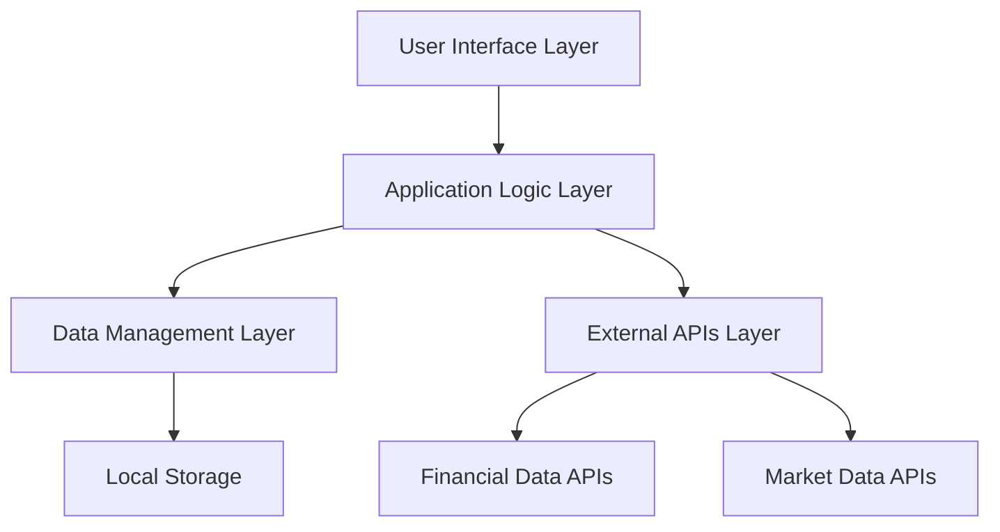

# Finance Calculator Design Document

## Overview

The Finance Calculator is a client-side web application built with modern web technologies to provide users with comprehensive financial management tools. The application will be implemented as a single-page application (SPA) with three main modules: Mortgage Calculator, Expense Tracker, and Investment Portfolio. The design emphasizes simplicity, real-time calculations, and secure local data storage.

## Architecture

### High-Level Architecture



### Technology Stack

- **Frontend Framework**: Vue 3 with TypeScript for type safety and component-based architecture
- **State Management**: Pinia for intuitive and type-safe state management
- **Styling**: SASS for responsive design and consistent styling
- **Data Storage**: Browser LocalStorage with encryption for sensitive data
- **External APIs**: 
  - Alpha Vantage or Yahoo Finance API for stock/crypto data
  - Real-time WebSocket connections for live market data
- **Build Tool**: Vite for fast development and optimized builds
- **Testing**: Vitest and Vue Testing Library for unit and integration tests

## Components and Interfaces

### Core Components

#### 1. App Component
- Main application shell with routing and global state management
- Handles theme switching and responsive layout
- Manages authentication state (if implemented)

#### 2. Dashboard Component
- Landing page with overview of all financial data
- Quick access cards for each major feature
- Summary widgets showing key metrics

#### 3. Mortgage Calculator Module

**MortgageCalculator Component**
```typescript
interface MortgageInputs {
  loanAmount: number;
  downPayment: number;
  interestRate: number;
  loanTermYears: number;
  propertyTax: number;
  homeInsurance: number;
  pmiRate?: number;
}

interface MortgageResults {
  monthlyPayment: number;
  principal: number;
  interest: number;
  monthlyTax: number;
  monthlyInsurance: number;
  monthlyPMI: number;
  totalMonthlyPayment: number;
  totalInterest: number;
  totalCost: number;
}
```

**Key Sub-components:**
- `MortgageInputForm`: Input fields with real-time validation
- `MortgageResults`: Display calculated results with breakdown
- `AmortizationSchedule`: Optional detailed payment schedule

#### 4. Expense Tracker Module

**ExpenseTracker Component**
```typescript
interface CreditCard {
  id: string;
  name: string;
  balance: number;
  creditLimit: number;
  minimumPayment: number;
  dueDate: Date;
  interestRate: number;
  monthlyInterest?: number;
  totalInterestPaid?: number;
  paymentHistory: PaymentRecord[];
}

interface PaymentRecord {
  date: Date;
  amount: number;
  interestCharged: number;
  principalPaid: number;
  remainingBalance: number;
}

interface CreditCardRecommendation {
  cardName: string;
  issuer: string;
  rewardStructure: RewardCategory[];
  annualFee: number;
  introAPR?: string;
  estimatedAnnualRewards: number;
  matchScore: number; // Based on spending habits
}

interface RewardCategory {
  category: string;
  rewardRate: number;
  cap?: number;
}

interface Expense {
  id: string;
  amount: number;
  category: string;
  description: string;
  date: Date;
  paymentMethod: string;
}

interface Budget {
  category: string;
  budgetAmount: number;
  spentAmount: number;
  remaining: number;
}
```

**Key Sub-components:**
- `CreditCardList`: Display and manage credit cards with interest tracking
- `InterestCalculator`: Calculate monthly interest and total interest over time
- `InterestChart`: Visual representation of total interest payments over time
- `PaymentSimulator`: Show impact of different payment amounts on interest
- `CardRecommendations`: Suggest optimal credit cards based on spending patterns
- `SpendingAnalysis`: Analyze spending by category to match with reward cards
- `ExpenseForm`: Add new expenses with categorization
- `BudgetOverview`: Visual budget tracking with progress bars
- `PaymentReminders`: Upcoming payment notifications

#### 5. Investment Portfolio Module

**InvestmentPortfolio Component**
```typescript
interface WatchlistItem {
  symbol: string;
  name: string;
  currentPrice: number;
  dailyChange: number;
  dailyChangePercent: number;
  type: 'stock' | 'crypto';
}

interface Holding {
  symbol: string;
  quantity: number;
  purchasePrice: number;
  currentPrice: number;
  currentValue: number;
  gainLoss: number;
  gainLossPercent: number;
}

interface Portfolio {
  totalValue: number;
  dailyGainLoss: number;
  totalGainLoss: number;
  holdings: Holding[];
}
```

**Key Sub-components:**
- `Watchlist`: Track stocks and crypto without ownership
- `PortfolioSummary`: Overview of total portfolio performance
- `HoldingsList`: Detailed view of individual investments
- `SearchBar`: Add new investments with autocomplete

### Shared Components

#### 1. Input Components
- `CurrencyInput`: Formatted currency input with validation
- `PercentageInput`: Percentage input with proper formatting
- `DatePicker`: Date selection for due dates and transactions

#### 2. Display Components
- `MetricCard`: Reusable card for displaying key metrics
- `ProgressBar`: Visual progress indicators for budgets
- `PriceDisplay`: Formatted price display with change indicators

#### 3. Navigation Components
- `Sidebar`: Main navigation between modules
- `TabNavigation`: Sub-navigation within modules

## Data Models

### Storage Schema

```typescript
interface AppData {
  mortgageCalculations: MortgageInputs[];
  creditCards: CreditCard[];
  expenses: Expense[];
  budgets: Budget[];
  watchlist: WatchlistItem[];
  portfolio: Holding[];
  creditCardRecommendations: CreditCardRecommendation[];
  spendingAnalysis: SpendingPattern[];
  settings: UserSettings;
}

interface SpendingPattern {
  category: string;
  monthlyAverage: number;
  percentage: number;
  trend: 'increasing' | 'decreasing' | 'stable';
}

interface UserSettings {
  currency: string;
  theme: 'light' | 'dark';
  notifications: boolean;
  autoSave: boolean;
}
```

### Data Flow

1. **User Input** → Component State → Context/Global State → Local Storage
2. **External API Data** → Service Layer → Component State → UI Update
3. **Calculations** → Pure Functions → Component State → UI Display

## Error Handling

### Input Validation
- Real-time validation for all numeric inputs
- Range validation (e.g., interest rates 0-30%)
- Required field validation with clear error messages
- Format validation for currency and percentage inputs

### API Error Handling
- Graceful degradation when market data APIs are unavailable
- Retry logic for failed API requests
- Fallback to cached data when possible
- User-friendly error messages for network issues

### Data Persistence Errors
- Handle LocalStorage quota exceeded scenarios
- Backup/restore functionality for data recovery
- Validation of stored data integrity on app load

## Testing Strategy

### Unit Testing
- Test all calculation functions with various input scenarios
- Test component rendering and user interactions
- Test data validation and error handling logic
- Mock external API calls for consistent testing

### Integration Testing
- Test complete user workflows (e.g., adding expense → updating budget)
- Test data persistence across browser sessions
- Test responsive design across different screen sizes

### End-to-End Testing
- Test critical user journeys from start to finish
- Test cross-browser compatibility
- Test performance with large datasets

### Test Coverage Goals
- Minimum 80% code coverage for business logic
- 100% coverage for financial calculation functions
- Comprehensive testing of error scenarios

## Credit Card Optimization Features

### Interest Calculation and Tracking

**Interest Payment Calculator**
- Calculate monthly interest charges based on balance and APR
- Track total interest paid over time for each card
- Show impact of different payment amounts on total interest
- Generate amortization-style schedules for credit card payoff

**Interest Visualization**
- Interactive charts showing total interest over time
- Comparison charts for minimum payment vs. higher payment amounts
- Visual representation of how much extra users pay due to interest
- Progress tracking toward debt payoff goals

### Credit Card Recommendation Engine

**Spending Analysis**
- Automatically categorize expenses to identify spending patterns
- Calculate monthly averages by category (dining, groceries, gas, etc.)
- Identify top spending categories for reward optimization

**Card Matching Algorithm**
```typescript
interface CardMatchingCriteria {
  topSpendingCategories: string[];
  monthlySpending: number;
  creditScore?: number;
  annualFeePreference: 'none' | 'low' | 'any';
  rewardPreference: 'cashback' | 'points' | 'miles' | 'any';
}
```

**Recommendation Features**
- Match users with optimal credit cards based on spending habits
- Calculate estimated annual rewards for each recommended card
- Compare net value (rewards minus annual fees)
- Include popular cards like:
  - Amex Gold (4x on dining and groceries)
  - Citi Custom Cash (5% on top spending category)
  - Chase Freedom categories
  - Capital One Savor (dining and entertainment)

**Card Database**
- Maintain database of popular credit cards with reward structures
- Regular updates to card offers and terms
- Integration with spending analysis for personalized recommendations

## Security Considerations

### Data Protection
- Encrypt sensitive data before storing in LocalStorage
- Never store full credit card numbers
- Implement data sanitization for all user inputs
- Use HTTPS for all external API communications

### Privacy
- No server-side data storage by default
- Clear data deletion options for users
- Transparent data usage policies
- Optional cloud sync with user consent

## Performance Optimization

### Client-Side Performance
- Lazy loading of modules to reduce initial bundle size
- Debounced calculations for real-time updates
- Efficient re-rendering with Vue's reactivity system and computed properties
- Virtual scrolling for large transaction lists

### API Usage Optimization
- Cache market data with appropriate TTL
- Batch API requests where possible
- Implement request rate limiting
- Use WebSocket connections for real-time data when available

## Accessibility

### WCAG 2.1 Compliance
- Proper semantic HTML structure
- Keyboard navigation support
- Screen reader compatibility
- High contrast color schemes
- Focus management for dynamic content

### Usability Features
- Clear visual hierarchy and typography
- Consistent interaction patterns
- Helpful tooltips and guidance text
- Mobile-first responsive design